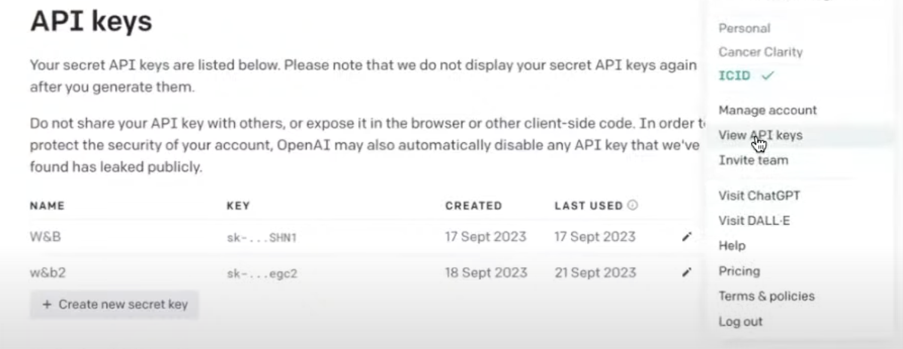

# [Generative AI for - Session 2](https://www.youtube.com/watch?v=hnnvnKYX8eI&t=2281s)

In this session we follow [panaverse/learn-nextjs/step22_generative_ai](https://github.com/panaverse/learn-nextjs/tree/main/step22_generative_ai)

## [usemage ai](https://usemage.ai)

- step 1

```sh
curl -sSL https://get.wasp-lang.dev/installer.sh | sh
```

- setp 2: move to project folder

```sh
cd <your-app-name>
wasp db migrate-dev # init the db
wasp start
```

### [Chat Dev](https://github.com/OpenBMB/ChatDev)

#### To get started, follow these steps:

1.  Clone the GitHub Repository: Begin by cloning the repository using the command:

```sh
git clone https://github.com/0penBMB/ChatDev.git
```

2. Set Up Python Environment:

- Ensure you have a version 3.9 or higher Python environment. You can create and activate this environment using the following commands, replacing ChatDev_conda_env with your preferred environment name:

```sh
conda create -n ChatDev_conda_env python=3.9 -y
conda activate ChatDev_conda_env
```

3. Install Dependencies:

- Move into the ChatDev directory and install the necessary dependencies by running:

```sh
cd ChatDev
pip3 install -r requirements.txt
```

4. Set OpenAI API Key: Export your OpenAI API key as an environment variable. Replace `your_OpenAI_API_key` with your actual API key. Remember that this environment variable is session-specific, so you need to set it again if you open a new terminal session. On Unix/Linux:

- go to OPEN AI [API_KEY](https://platform.openai.com/account/api-keys)



```sh
export OPENAI_API_KEY="your_OpenAI_API_key"
```

5. Build Your Software: Use the following command to initiate the building of your software, replacing `[description_of_your_idea]` with your idea's description and `[project_name]` with your desired project name: On Unix/Linux:

```sh
cd WareHouse/project_name_DefaultOrganization_timestamp
python3 main.py
```

for checking db we install [DBeaver](https://dbeaver.io)

## [Langchain](https://www.langchain.com)

You can read TS docs here
[Langchain TS Introduction](https://js.langchain.com/v0.2/docs/introduction/)

[Installation](https://js.langchain.com/v0.2/docs/how_to/installation/)

1. Create and navigate to new directory

```sh
mkdir lanchain
cd lanchain

```

2. Initialize a new Node.js project:

```sh
npm init -y
```

3. Install TypeScript and other dependencies:

```sh
npm install typescript ts-node @types/node --save-dev
npm install -g typescript
npm install langchain
npm i dotenv
```

4. Initialize TypeScript configuration:

```sh
npx tsc --init
```

5. Update `tsconfig.json` by changing properties as follows

```json
{
  "compilerOptions": {
    "target": "ES2020",
    "module": "nodenext",
    "rootDir": "./src",
    "outDir": "./dist",
    "esModuleInterop": true,
    "forceConsistentCasingInFileNames": true,
    "strict": true,
    "skipLibCheck": true
  }
}
```

6. Update `package.json` and following to it before `scripts`

```json
"type": "module",
```

7. Create API key from open AI

   1. Login to [Open AI](https://openai.com/)
   2. Navigate to API page
   3. Click your `profile` on the top right corner
   4. Check your free limit from `Usage` tab, if limit expired buy credits or use some different account
   5. Click `View API Keys`
   6. From the left sidebar open `Api Keys`
   7. Create new secret key
   8. Save your generated key

8. Create `.env` file

   ```env
   OPENAI_API_KEY="<OPEN_KEYS_PASTE_HERE>"
   ```

9. Create `.gitignore` file

   ```gitignore
   node_modules
   .env
   ```

10. Create `app.ts` file

    ```ts
    //import { OpenAI } from "langchain/llms/openai";
    import { OpenAI } from "@langchain/openai";
    import "dotenv/config";
    const llm = new OpenAI({
      openAIApiKey: process.env.OPENAI_API_KEY,
      temperature: 0.9,
    });
    async function main() {
      const result = await llm.predict(
        `What would be a good company name for a company that makes colorful socks?`
      );
      console.log(result);
    }
    main();
    ```

11. Transforms TypeScript code into JavaScript code

```bash
 tsc
```

12. Run the app

```bash
 node ./dist/app.js
```
